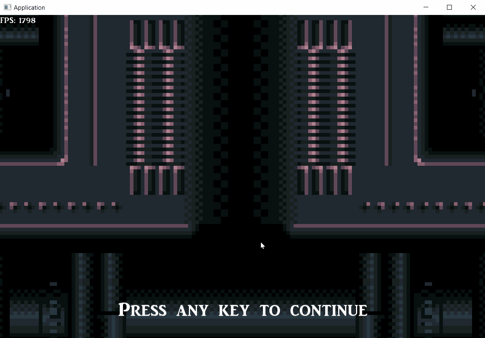

# 2D_Game
This is a pretty small game created for my thesis: "Creation of a cross-platform 2D Game using a data oriented approach". Features: one-way platforms, coins, hazards, enemies and ladders.

## Built With

* [SFML](https://www.sfml-dev.org/) - The framework used for rendering
* [entt](https://github.com/skypjack/entt) - Open source library used for the ECS
* [CMake](https://cmake.org/) - Build System
* [conan](https://conan.io/) - Open source package manager/dependency manager
* [Tiled](https://www.mapeditor.org/) - Tilemap editor
* [tmxlite](https://github.com/fallahn/tmxlite) - Parse tilemaps exported from Tiled
* [box2d](https://box2d.org/) - A 2D Physics Engine for Games
* [spdlog](https://github.com/gabime/spdlog) - Logging library

## Prerequisites

#### Tiled

```
[OPTIONAL] Download and install Tiled if you want to modify the tilemaps
```

### $Windows

#### Python/pip
```
Download and install Python and pip from the official website.
```

#### CMake
```
Donwload and install CMake from the official website.
```

#### conan
After installing pip run the following command:
```
pip install conan
```

## Installing

### Clone the repo
```
git clone https://github.com/ggiap/2D_Game.git
cd 2D_Game
```

### Initialize and update the submodules
```
git submodule update --init --recursive
```

### Create a build folder

```
mkdir build
cd build
```

### Build the executable

***Using MinGW:***
##### Debug build
```
cmake -G "MinGW Makefiles" -DCMAKE_BUILD_TYPE=Debug ..
mingw32-make -j4
```

##### Release build
```
cmake -G "MinGW Makefiles" -DCMAKE_BUILD_TYPE=Release ..
mingw32-make -j4
```

##### Run
```
cd bin
./2D_Game
```


***Using MSVC:***
##### Debug build
```
cmake -DCMAKE_BUILD_TYPE=Debug ..
```

```
cmake --build . --config Debug
```

##### Release build
```
cmake -DCMAKE_BUILD_TYPE=Release ..
```

```
cmake --build . --config Release
```

##### Run
```
cd bin
```

```
./2D_Game
```


### $Manjaro

#### pip
```
sudo pacman -Syu python-pip
```

#### conan
```
pip install conan
```

#### CMake
```
sudo pacman -Syu cmake
```

#### make
```
sudo pacman -Syu make
```

#### SFML
Download all the dependencies with your package manager for SFML before building the project:

* freetype
* x11
* xrandr
* udev
* opengl
* flac
* ogg
* vorbis
* vorbisenc
* vorbisfile
* openal
* pthread


## Installing

### Clone the repo
```
git clone https://github.com/ggiap/2D_Game.git && cd 2D_Game
```

### Initialize and update the submodules
```
git submodule update --init --recursive
```

### Create a build folder

```
mkdir build
cd build
```

### Build the executable

##### Debug build
```
cmake -DCMAKE_BUILD_TYPE=Debug .. && make -j4
```

##### Release build
```
cmake -DCMAKE_BUILD_TYPE=Release .. && make -j4
```

##### Run
```
cd bin && ./2D_Game
```



## Controls

* **W A S D:** Control main character
* **- +:** Zoom in/out
* **Arrows:** Camera panning
* **Left mouse button:** Grab and move bodies
* **Num1:** SFML debug draw
* **Num2:** Box2D debug draw
* **Esc:** Pause
* **Backspace:** (While in pause state) Return to menu
* **P:** Spawn enemy
* **I:** Reset camera target

## License

This project is licensed under the MIT License - see the [LICENSE.md](https://github.com/ggiap/2D_Game/blob/master/LICENSE) file for details

